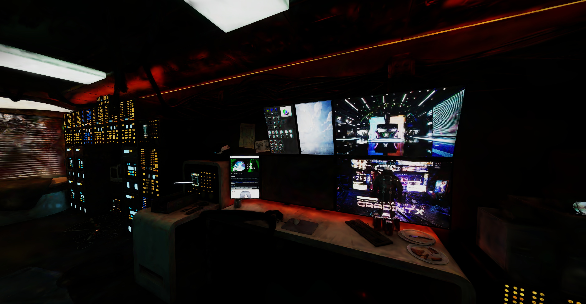
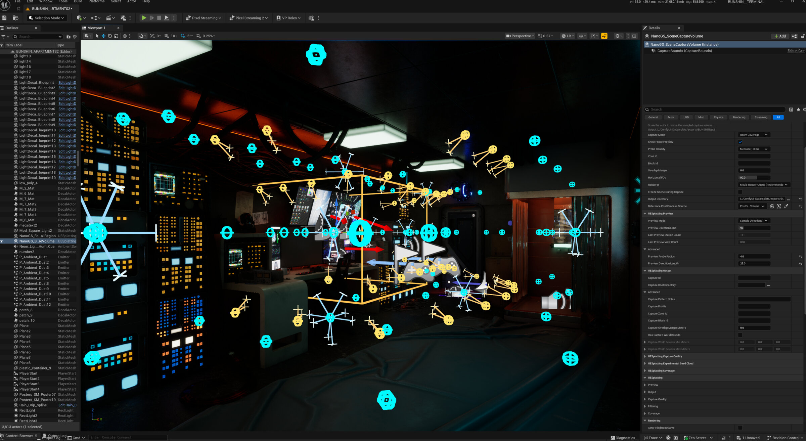

# UESplatting

UESplatting is an Unreal Engine 5.8 plugin for importing, rendering, and loading
3D Gaussian splats. The optional **UESplatting Capture** plugin adds Beta editor
tools for capturing Unreal scenes as known-pose training datasets.

The renderer is derived from
[TimChen1383/NanoGaussianSplatting](https://github.com/TimChen1383/NanoGaussianSplatting)
by TimChen and is distributed under the MIT License.

*An Unreal scene captured with UESplatting Capture and reconstructed as a
Gaussian splat.*

## Features

- Import standard binary 3DGS PLY files.
- Import compressed PLY files.
- Import gzip SPZ v1-v3 files with SH degree 0-3.
- Render splats through a custom Unreal RDG renderer.
- Load supported files asynchronously from Blueprint or C++ at runtime.
- Optionally build an experimental plugin-owned Cluster LOD hierarchy.
- Export Room Coverage, Directional Array, and Focused Detail training datasets
  from the editor (Beta).

## Requirements

- Unreal Engine 5.8
- A C++ toolchain supported by Unreal Engine
- A C++ Unreal project

Windows with D3D12 is the currently tested platform.

## Installation

1. Copy [`Plugins/UESplatting`](Plugins/UESplatting) into your project's
   `Plugins` directory.
2. Regenerate project files if Unreal requests it.
3. Build your project's Editor target.
4. Confirm **UESplatting** is enabled under **Edit > Plugins > Rendering**.

Dataset capture is optional. Copy
[`Plugins/UESplattingCapture`](Plugins/UESplattingCapture) alongside the core
plugin and enable **UESplatting Capture** only when those editor tools are
needed.

See [Installation](docs/INSTALLATION.md) for build and packaging commands.

## Importing Splats

Drag a supported `.ply` or `.spz` file into Content Browser. UESplatting creates a
Gaussian Splat asset that can be placed and transformed like any other actor in
the level.

The same decoder is used for import, reimport, Cluster LOD source reads, and
runtime loading. See [Supported Formats](docs/FORMATS.md) for details.

## Runtime Loading

Place a **Gaussian Splat Actor**, set **Runtime Splat File**, and enable
**Load Runtime Splat On Begin Play**. Blueprint and C++ callers can also call
`LoadSplatFromFileAsync` directly.

See [Runtime Loading](docs/RUNTIME-LOADING.md) for file deployment and callback
details.

## Scene Capture (Beta)

The optional UESplatting Capture plugin provides Room Coverage, Directional
Array, and Focused Detail workflows that export perspective images, exact
camera poses, Nerfstudio transforms, and a COLMAP text model. An experimental
collision-derived seed cloud is available as an opt-in export. The plugin uses
one Movie Render Queue sequence for the complete capture.

*Room Coverage previewing translated probe positions and sampled view
directions in Unreal Editor.*

See [Scene Capture](docs/SCENE-CAPTURE-BETA.md) for setup and output format.

## Demo Project

[`UESplattingDemo.uproject`](UESplattingDemo.uproject) is a minimal UE 5.8 host
with a generated 37,782-splat sample. The fixture is synthetic and distributed
under the repository license.

## Documentation

- [Installation](docs/INSTALLATION.md)
- [Supported formats](docs/FORMATS.md)
- [Runtime loading](docs/RUNTIME-LOADING.md)
- [Scene capture](docs/SCENE-CAPTURE-BETA.md)
- [Troubleshooting](docs/TROUBLESHOOTING.md)
- [Development](docs/DEVELOPMENT.md)

## Current Limitations

- SPZ v4/Zstandard is not supported.
- `.splat`, `.ksplat`, `.sog`, and dynamic Gaussian formats are not supported.
- Splats do not contribute to Lumen or hardware ray tracing.
- Cluster LOD is experimental and has not yet been benchmarked across
  representative captures.
- Packaged builds are untested. Development and validation happen in the Unreal
  Editor, so runtime loading in a packaged game may not work as expected.
- UESplatting Capture is editor-only and Beta.

## License

UESplatting is distributed under the MIT License and retains the upstream
NanoGaussianSplatting attribution. See
[`LICENSE`](LICENSE), [`NOTICE`](NOTICE), and
[`THIRD_PARTY_NOTICES.md`](THIRD_PARTY_NOTICES.md).
